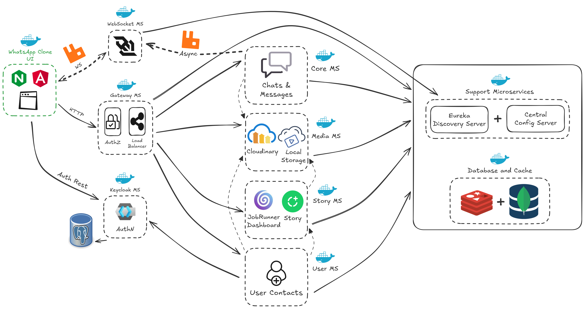

# 🟢 WhatsApp Clone App — Full Microservices System

A WhatsApp-like chat system built with **Spring Boot microservices**, **Angular**, and **Docker**, featuring real-time messaging, media sharing, stories, authentication via Keycloak, and service discovery via Eureka.

---

## Architecture Overview



This project follows a microservices architecture with the following components:

| Component                                         | Description                                                | Port    |
|---------------------------------------------------|------------------------------------------------------------|---------|
| **config-server**                                 | Centralized configuration using Spring Cloud Config        | 8071    |
| **eureka-server**                                 | Service discovery using Spring Cloud Netflix Eureka        | 8090    |
| **keycloak**                                      | Authentication and authorization (OAuth2 / OpenID Connect) | 9090    |
| **core-ms**                                       | Core messaging microservice (handles messages & chats)     | 8091    |
| **media-ms**                                      | Media upload and retrieval (images, audio, attachments)    | 8092    |
| **story-ms**                                      | Story and status management                                | 8093    |
| **user-ms**                                       | User management, profiles, and contacts                    | 8094    |
| **web-socket-ms**                                 | WebSocket-based real-time communication                    | 8095    |
| **gateway-ms**                                    | API Gateway and global authentication layer                | 8080    |
| **mongo**, **postgres**, **redis**, **rabbitmq**  | Databases and message broker                               | various |
| **whatsapp-clone-ui**                             | Angular frontend served with Nginx                         | 4200    |

---

## Tech Stack

### Backend (Java 17 / Spring Boot)
- Spring Boot 3+
- Spring Cloud (Eureka, Config Server, Gateway)
- Spring Security with Keycloak
- gRPC communication between services
- RabbitMQ for event streaming
- Redis caching
- MongoDB for media & stories
- Docker & Docker Compose for deployment

### Frontend
- Angular 17
- SCSS styling
- Nginx deployment
- Real-time updates via SockJs

---

## How to Run

### Clone the repository
```bash
git clone https://github.com/MohamedAhmed412000/Whatsapp-clone.git
cd ./Docker
docker compose up -d
```

## Access URLs

After running the project using Docker Compose, you can access the following services:

| Service                       | Description                                                 | URL / Port                                                                               |
|-------------------------------|-------------------------------------------------------------|------------------------------------------------------------------------------------------|
| **WhatsApp UI (Frontend)**    | Angular app served via Nginx                                | [http://localhost:4200](http://localhost:4200)                                           |
| **Backend API Gateway**       | Entry point for backend Swagger APIs (secured via Keycloak) | [http://localhost:8080](http://localhost:8080)                                           |
| **Eureka Server (Discovery)** | Service registry dashboard                                  | [http://localhost:8090](http://localhost:8090)                                           |
| **RabbitMQ Management UI**    | Queue monitoring dashboard                                  | [http://localhost:15672](http://localhost:15672) <br>Default credentials → `admin:admin` |
| **Keycloak**                  | Authentication & Authorization Server                       | [http://localhost:9090](http://localhost:9090) <br>Default credentials → `admin:admin`   |

---

## Swagger URLs

| Service | Swagger Link                                                                                         |
|---------|------------------------------------------------------------------------------------------------------|
| Core    | [View API Docs](https://mohamedahmed412000.github.io/Whatsapp-clone/?urls.primaryName=Core+Service)  |
| Media   | [View API Docs](https://mohamedahmed412000.github.io/Whatsapp-clone/?urls.primaryName=Media+Service) |
| Story   | [View API Docs](https://mohamedahmed412000.github.io/Whatsapp-clone/?urls.primaryName=Story+Service) |
| User    | [View API Docs](https://mohamedahmed412000.github.io/Whatsapp-clone/?urls.primaryName=User+Service)  |
